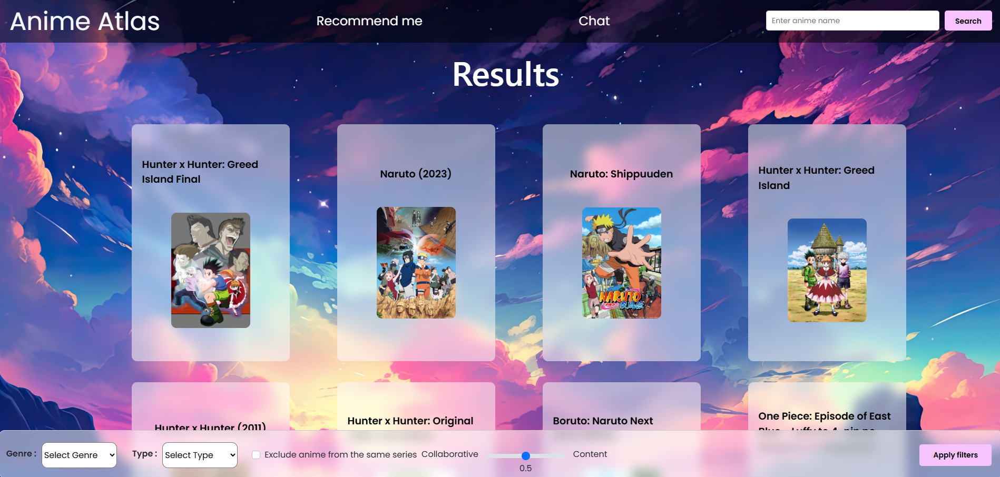

# **Anime Atlas: Your Personal Anime Recommendation App**

## **Overview**

Anime Atlas is an intuitive Anime Recommendation application designed to help you discover your next favorite anime! Built as part of the **Smart Project**, this application suggests personalized anime recommendations based on your preferences.

For detailed information about the project, please refer to the **'Projet_SMART_2024.pdf'** file located in the **documentation** folder.

## **Key Features**

- **Personalized Anime Recommendations**: Get tailored anime suggestions based on your viewing history and preferences.
- **Comprehensive Search**: Easily search for your favorite anime using a dynamic search bar and filter options.
- **Chatbot Assistance**: Have questions? Our chatbot is ready to answer all your anime-related queries.
- **User Interaction**: Add anime to your liked list and keep track of your favorites with ease.

## **Application Screenshots**

Here’s a preview of what the Anime Atlas application looks like in action:

- **Home Page**: The app's main page, featuring a search bar for quick anime searches and a personalized list of anime you've liked.

  

- **Search Results**: See the search results based on your query, with options to filter through various anime titles.

  

- **Description Page**: Explore detailed descriptions of each anime and decide whether to add it to your liked list.

  

- **Chatbot**: Need help finding the perfect anime? Our chatbot can assist you with anime recommendations and more!

  

- **Recommendations**: A curated list of anime recommendations based on your preferences and viewing history.

  

## **How to Use Anime Atlas**

Ready to dive into the world of anime? Follow these simple steps to get started:

1. **Clone the repository** to your local machine
2. **Navigate to the project directory** using your terminal or command prompt.

3. **Install required dependencies**:
   ```
   pip install -r requirements.txt
   ```

4. **Launch the app**:
   ```
   python app.py
   ```

Now you're all set to enjoy personalized anime recommendations and explore the world of anime with Anime Atlas!
